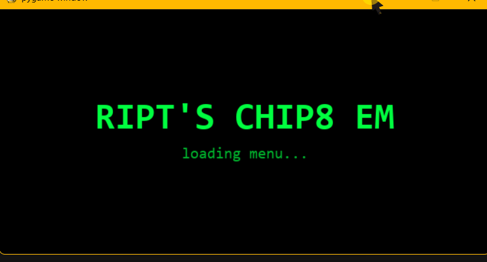

# CHIP-8

A CHIP-8 emulator written in Python, faithful to Cowgod's spec, with a full menu, live settings, colour themes, background music, and a boot splash. Runs the classic ROMs (Pong, Tetris, Space Invaders, Brix) and passes the Timendus test suite.



## Features

- Complete 35-opcode CPU with correct VF handling on arithmetic, shifts, and sprite collision
- XOR sprite rendering with edge wrapping
- 16-key hex keypad, including the blocking `Fx0A` wait-for-keypress
- 60Hz delay + sound timers driving a square-wave beep
- Four colour themes (phosphor, amber, gameboy, ibm) — switchable at runtime or from settings
- Adjustable cycle rate at runtime (some games want faster, some slower)
- Background music playlist (drop `.ogg` or `.mp3` files in `music/`)
- Boot splash, main menu, ROM picker, and a persistent settings screen (`settings.json`)
- Pause and hot-reset
- Pytest suite covering the tricky opcodes (BCD, arithmetic carry, sprite collision, sub-with-borrow)

## Install

```bash
git clone https://github.com/<you>/chip8
cd chip8
python -m venv .venv
.\.venv\Scripts\Activate.ps1        # Windows PowerShell
# source .venv/bin/activate         # macOS / Linux
pip install -r requirements.txt
```

## Run

```bash
python main.py                      # opens the menu
python main.py roms/Pong.ch8        # skip the menu, launch straight into a ROM
```

## Controls

**Keypad — CHIP-8 keys on the left, your keyboard on the right:**

| CHIP-8 | Keyboard |
|:---:|:---:|
| 1 2 3 C | 1 2 3 4 |
| 4 5 6 D | Q W E R |
| 7 8 9 E | A S D F |
| A 0 B F | Z X C V |

**In-game:**

| Key | Action |
|---|---|
| Esc | Back to menu |
| Tab | Cycle theme |
| P | Pause |
| R | Reset ROM |
| M | Toggle music |
| N | Next music track |
| `[` / `]` | Music volume down / up |

**Menus:**

| Key | Action |
|---|---|
| ↑ ↓ / W S | Navigate |
| ← → / A D | Adjust value (settings) |
| Enter | Select |
| Esc | Back |

## Architecture

```
chip8/
├── cpu.py         # class Chip8 — pure emulation, no I/O, unit-testable
├── display.py     # Renderer + colour themes (pygame)
├── audio.py       # Beeper class — square wave tied to sound_timer
├── music.py       # MusicPlayer — background playlist over pygame.mixer.music
├── input.py       # keyboard → CHIP-8 keypad mapping
├── font.py        # 16 hex-digit font sprites at memory 0x50
├── intro.py       # boot splash animation
├── menu.py        # main menu, ROM picker, settings screen
└── settings.py    # Settings dataclass with JSON persistence
main.py            # frontend: pygame setup + state machine
tests/
└── test_cpu.py    # pytest suite for the CPU
```

The CPU is completely I/O-free — no pygame, no filesystem calls inside opcodes. `main.py` writes into `chip.keys` each frame and reads back `chip.framebuffer` and `chip.sound_timer`. Everything else — rendering, audio, music, menus — is a separate layer that only talks to the CPU through those attributes. That separation is what makes the CPU unit-testable and would make it portable to a different frontend (terminal, web).

## Test

```bash
python -m pytest tests/ -v
```

Covers: `6xkk`, `8xy4` (add with carry), `8xy5` (sub, borrow flag), `Fx33` (BCD), `Dxyn` (sprite collision).

## ROMs

`.ch8` files aren't distributed with the repo. Grab public-domain ones from [dmatlack/chip8/roms](https://github.com/dmatlack/chip8/tree/master/roms) and drop them into `roms/`. `Pong.ch8`, `Tetris.ch8`, `Space Invaders.ch8`, and `Brix.ch8` all work.

## Author

Rayan Shamsi — First-Class BSc Computer Science, University of Reading (2026). Based in Oxford, hunting Junior SWE / AI Engineer roles. [LinkedIn](https://linkedin.com/in/<you>)
